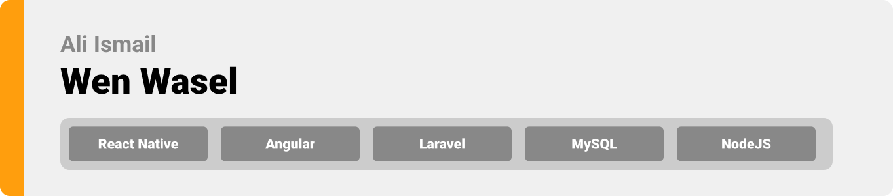

<div align="center">

> Hello world! Wen Wasel is aimed at organizing the lebanese public transportation systems and guiding users to their destinations. 
 


**[PROJECT PHILOSOPHY](https://github.com/ali-ismail02/wen-wasel#project-philosophy) • [WIREFRAMES](https://github.com/ali-ismail02/wen-wasel#wireframes) • [TECH STACK](https://github.com/ali-ismail02/wen-wasel#tech-stack) • [IMPLEMENTATION](https://github.com/ali-ismail02/wen-wasel#impplementation) • [HOW TO RUN?](https://github.com/ali-ismail02/wen-wasel#how-to-run)**

</div>

<br><br>


> Since your average joe (me) doesn't know how to navigate through lebanon with all the different routes of every bus and cab drivers expected payments. Wen Wasel is an app that solves all the above by guiding the user to live bus stops and previous cab rides.
> 
> The app allows bus drivers to input their routes with their arrival time and shares their live location with the users. Ensuring more passengers on their respective routes.
>
> The app allows passengers to book seats at buses and browse through different possible routes to their destination as well as providing them with live guidance to their destination.

### User Stories
- As a bus driver, I want to add routes, so that I can find more passengers.
- As a passenger, I want to find a route, so that I can reach my destination.
- As a passenger, I want to book bus seats, so that I can ensure it's availibility.

<br><br>


> This design was planned before on paper, then moved to Figma app for the fine details.
Note that i didn't use any styling library or theme, all from scratch and using pure css modules

| Landing  | Home/Search  | Routes  |
| -----| -----| -----|
|  |  |  |

| Bus Driver  | Viewing Routes  | Adding Route  |
| -----| -----| -----|
| .png) | .png) |  |

| Landing  | Home/Search  | Routes  |
| -----| -----| -----|
|  |  |  |

| Bus Driver  | Viewing Routes  | Adding Route  |
| -----| -----| -----|
| .png) | .png) |  |

| Admin Panel  | Admin Analytics  |
| -----| -----|
|  |  |

<br><br>


Here's a brief high-level overview of the tech stack the Well app uses:

- This project uses [React Native mobile app framework](https://reactnative.dev/). React Native is an open-source UI software framework created by Meta Platforms, Inc. It is used to develop mobile applications by enabling developers to use the React framework along with native platform capabilities.
- This project uses [Angular web app framework](https://angular.io/). Angular is a TypeScript-based free and open-source web application framework led by the Angular Team at Google and by a community of individuals and corporations.
- This project uses [Laravel PHP web framework](https://laravel.com/). Laravel is a free and open-source PHP web framework intended for the development of web applications following the model–view–controller architectural pattern and based on Symfony.
- For persistent storage (database), the app uses [MySQL](https://www.mysql.com/). MySQL is an open-source relational database management system.
- To view driver's live location, the app uses the a [NodeJS runtime environment](https://nodejs.org/en/) server.
- In order to use [Google Maps API](https://developers.google.com/maps) for location and map cabs, the app uses [react-native-maps library](https://github.com/react-native-maps/react-native-maps)


<br><br>


> Using the above mentioned tecch stacks and the wireframes build with figma from the user sotries we have, the implementation of the app is shown as below, these are screenshots from the real app

| Landing | Light-Dark Theme | Passenger-Driver Live Location | 
|---|---|---|
|  |  |  |

| Searching for Destination | Passenger Choosing Ride Type | Passenger Choosing Path |
|---|--- |---|
|  |  |  |

| Passenger Booking seat | Passenger Traversing Path | Updating Profile |
|---|---|---|
|  |  |  |

| Bus Choosing Presaved Route | Bus Delaying Routes | Bus Adding Routes |
|---|--- |---|
|  |  |  |

| Admin Bus driver |
|---|
|  |

| Bus Driver Information |
|---|
|  |

| Admin Analytics |
|---|
|  |

<br><br>


> This is an example of how you may give instructions on setting up your project locally.
To get a local copy up and running follow these simple example steps.

### Prerequisites

This is an example of how to list things you need to use the software and how to install them.

- Download and Install [Node.js](https://nodejs.org/en/)
- Download and Install [Composer](https://getcomposer.org/download/)
- Download and Install [XAMPP](https://www.apachefriends.org/download.html)

- npm
  ```sh
  npm install npm@latest -g
  ```
- Nodemon
  ```sh
  npm install -g nodemon
  ```
- Expo CLI
  ```sh
  npm install --global expo-cli
  ```
- Expo Go app for iOS and Android
  > 🤖 [Android Play Store](https://play.google.com/store/apps/details?id=host.exp.exponent) - Android Lollipop (5) and greater.  
  > 🍎 [iOS App Store](https://apps.apple.com/app/expo-go/id982107779) - iOS 11 and greater.
- Angular CLI
  ```sh
  npm install -g @angular/cli 
  ```

### Installation

1. Clone the repo

   ```sh
   git clone https://github.com/Hamze-Ammar/Parking-Finder.git
   ```

#### To Run The Mobile App

1. Navigate to the Frontend folder and install dependencies
   ```sh
   cd frontend
   npm install
   ```
2. Run the start up command
   ```sh
   expo start
   ```

#### To Run Admin panel (Angular)

1. Navigate to the admin-frontend/admin_frontend folder
   ```sh
   cd admin-frontend/admin_frontend
   ```
2. Run the follwoing command
   ```sh
   ng serve
   ```

#### To Run Laravel Server on your machine

1. Create a database locally named wen_waseldb

2. Navigate to the backend folder
   ```sh
   cd Parking-Finder/backend
   ```
3. Inside the .env file in your backend folder
   - Insert the db name as follow -> DB_DATABASE= -> DB_DATABASE=wen_waseldb
4. Run migration
   ```sh
   php artisan migrate
   ```
5. Run the seeder
   ```sh
   php artisan db:seed
   ```
6. Start the Server (local IP)
   ```sh
   php artisan serve --port 8000 --host "Your IP"
   ```
7. Start the Server (localhost)
   ```sh
   php artisan serve
   ```

#### To Run NodeJS Server (socket.io) on your machine

1. Navigate to the socket-backend/socket-server folder
   ```sh
   cd socket-backend/socket-serverd
   ```
2. Run the server
   ```sh
   npx nodemon
   ```
